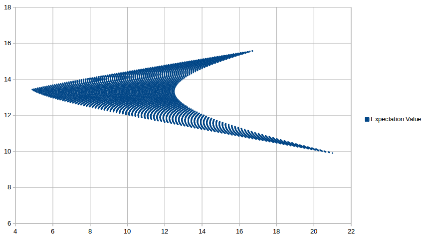

# Portfolio-Selector

Portfolio-Selector is a PHP library that helps you to optimize your stock portfolio.

Portfolio-Selector requires PHP >= 5.3.3.

# Table of Contents

- [Installation](#installation)
- [Basic Usage](#basic-usage)
- [License](#license)


## Installation

```sh
composer require larsbadke/portfolio-selector
```

## Basic Usage

First create some stock objects and submit performances to them.

```php
<?php

// Create Apple stock object and set performances in percent.
$apple = new Stock('Apple');
$apple->setPerformances([0, 3, 0, 3]);

// Create Google stock object.
$google = new Stock('Google');
$google->setPerformances([0, 3, 0, 3]);

// Create a new portfolio instance and add your stocks to it
$portfolio = new Portfolio();
$portfolio->add($apple);
$portfolio->add($google);


```

Now you have access to all typical key figures.

```php
<?php

// Get the expectation value of your portfolio
$portfolio->expectation();

// Get the variance of your portfolio
$portfolio->variance();


```

To optimize your portfolio just create a Selector instance  `$selector = new Selector($portfolio)` and run `$selector->run()`.

```php
<?php

$selector = new Selector($portfolio);

$selector->run();


```

#### Full example

```php
<?php

// create portfolio
$portfolio = new Portfolio();

// create stock with performances
$intel = new Stock('Intel');
$intel->setPerformances([38.4, -11.6, 2.9]);

$nike = new Stock('Nike');
$nike->setPerformances([20.2, 33.3, -6.8]);

$visa = new Stock('Visa');
$visa->setPerformances([18.2, 15.4, 6.7]);

// add stocks to portfolio
$portfolio->add($intel);
$portfolio->add($nike);
$portfolio->add($visa);

// create portfolio selector
$selector = new Selector($portfolio);

// run portfolio selection
$selector->setInterval(1);
$selector->run();

foreach ($selector->results() as $result) {
    
    $variance = round($result['variance'] * 100, 2);
    
    $expectation = round($result['expectation'] * 100, 2);

    echo "{$variance};{$expectation}<br>";
}

// 4.9;13.43
// 4.99;13.45
// 5.08;13.48
// 5.18;13.5
// 5.28;13.52
// 5.38;13.54
// 5.48;13.56
// 5.58;13.58
// 5.68;13.6
// 5.78;13.63
// 5.89;13.65
// 5.99;13.67
// 6.1;13.69
// 6.21;13.71
// 6.31;13.73
// 6.42;13.75
// 6.53;13.77
// 6.64;13.8
// 6.75;13.82
// 6.86;13.84
// 6.97;13.86
// 7.09;13.88
// 7.2;13.9
// 7.31;13.92
// 7.43;13.95
// 7.54;13.97
// 7.65;13.99
// 7.77;14.01
// 7.89;14.03
// 8;14.05
// 8.12;14.07
// ...

```



### Attention 
A high amount of stocks or a low allocation interval can increase the execution time enormously.
If you want to optimize a portfolio with many stocks, just use a higher allocation interval.

### More
More about portfolio selection:
[Wikipedia](https://en.wikipedia.org/wiki/Modern_portfolio_theory)

## License

Portfolio-Selector is released under the MIT Licence. See the bundled LICENSE file for details.